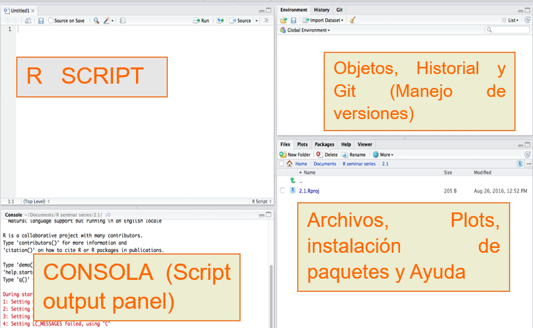

# CAPÍTULO 1: Introducción al análisis espacial utilizando R

## Instalación de R y RStudio

**R**, también conocido como “GNU S”, es un entorno y un lenguaje para el analisis estadístico y la generación de gráficos. R es un lenguage derivado del programa S, desarrollado en los Laboratorios Bell por John Chambers [@richard_a._becker_s_nodate].<!-- Insertado Todavia me falta afinar -->

R provee un acceso relativamente sencillo a una amplia variedad de técnicas estadísticas y graficas. Adicionalmente, R constituye un lenguaje de programación completo con el que añadir nuevas técnicas mediante la definición de funciones. “S ha modificado para siempre la forma en la que las personas analizan, visualizan y manipulan los datos” (Association of Computer Machinery Software System Award 1998 a John Chambers).

Actualmente, S y R son los dos lenguajes más utilizados en investigación en estadística. 

Los grandes atractivos de R/S son: 

- La capacidad de combinar, sin fisuras, análisis “preempaquetados” (ej., una regresión logística) con análisis ad-hoc, específicos para una situación: capacidad de manipular y modificar datos y funciones. 
- Los gráficos de alta calidad: visualización de datos y producción de gráficos para papers.
- La comunidad de R es muy dinámica, con gran crecimiento del número de paquetes, e integrada por estadísticos de gran renombre (ej., J. Chambers, L. Terney, B. Ripley, D. Bates, etc.). 
- Hay extensiones específicas a nuevas ´áreas como bioinformática, geoestadística y modelos gráficos.
- Es un lenguaje orientado a objetos.

### Obtención e instalación de R / Rstudio

Depende del sistema operativo, pero todo se puede encontrar en:

  - [http://cran.es.r-project.org/bin](http://cran.es.r-project.org/bin)

**Windows:** se puede obtener un ejecutable desde  [http://cran.es.r-project.org/bin/windows/base](http://cran.es.r-project.org/bin/windows/base) por ejemplo la versión de 32 bits [R-2.4.1-win32.exe](http://cran.es.r-project.org/bin/windows/base/R-2.4.1-win32.exe)

Al ejecutar el archivo se instalará el sistema base y los paquetes recomendados. 

**GNU/Linux:** (dos opciones) 

a. Obtener el R-x.y.z.tar.gz y compilar desde las fuentes. También bajar los paquetes adicionales e instalarlos. (Buena forma de comprobar que el sistema tiene development tools). 

b. Obtener binarios (ej., \*.deb para Debian, \*.rpm para RedHat, SuSE, Mandrake)

### RSTUDIO

Es una poderosa herramienta de desarrollo integrado un ambiente de desarrollo integrado, donde se puede desarrollar los diferentes proyectos que se aborden utilizando el leguaje R.

Se puede descargar la última versión del programa desde:

[https://www.rstudio.com/](https://www.rstudio.com/)

#### Ambiente de Desarrollo



## Introducción a la programación

### Hola Mundo

**R** Utilizamos la función *print()* para desplegar información en la pantalla

```{r}
##Hola Mundo
print("Hola Mundo")
print(paste('Hola,', 'como', 'estas?'))
```

### Calculadora

**R** puede ser utilizado como calculadoradesde la consola, tiene diversas funciones como ser *sqrt* (raiz cuadrada), *pi* (número pi), *sin* (la función seno), y muchos otros. Aca se puede encontrar una lista de algunos de ellos [https://www.rdocumentation.org/packages/pbdDMAT/versions/0.5-1/topics/math](https://www.rdocumentation.org/packages/pbdDMAT/versions/0.5-1/topics/math).

```{r}
#Operaciones básicas
2+2/2
#utilizando la funcion raiz cuadrada
sqrt(9)/3
#el numero pi
pi
#utilizando la función seno
sin(23)
```

#### Vectores

Uno de los elementon básicos con los que se trabaj en R son los vectores. Un **vector** es una secuencia de datos de algún elemento básico.

```{r}
# Números
c(1,2,3,4,5)
#lógicos
c(T,F,T,T,T)
#cadenas
v <- c("Hola", "Como", "estas")
```

Para acceder a los datos se utiliza los corchetes **[]** con el número en la posición del vector

```{r}
print(v[1])
```

#### Matrices

Una **Matriz** es un arreglo bidimensional en R se utiliza la funcion *matrix()*.

```{r}
m <- matrix(
  c(1,2,3,4,5,6,7,8,9), #Elementos de la matriz
  nrow = 3, #Número de filas
  ncol = 3, #Número de columnas
  byrow = T #Llenar por filas
)
print(m)
```

Al igual que en los vectores se puede acceder las mismos utilizando los corchetes *[row,col]* colocando primero la posición de la fila seguido de la posición de columna.

Tanto en vectores como en matrices es posible realizar operaciones entre ellos es decir suma, producto, producto escalar y otros tanto con vectores y matrices.

####Listas

Las listas son vectores(arreglos) genéricos que puede contener cualquier tipo de elemento, y para crear un elemento tipo lista utilizamos la funcion *list()*.

```{r}
n = c(2, 3, 5) 
s = c("aa", "bb", "cc", "dd", "ee") 
b = c(TRUE, FALSE, TRUE, FALSE, FALSE) 
x = list(n, s, b, 3)   # x contains copies of n, s, b
```

Al igual que en los vectores para acceder a los elementos, se utiliza los corchetes *[]* y te retorna el elemento de la posición.

```{r}
print(x[1])
```

#### Data Frames

Son los elementos masutilizados al momento de realizar operaciones en el trabajo con R, un **Data Frame** es una tabla donde cada columna es representada por un vector, basicamnete seria una lista de vectores de igual tamaño. Para definir un **Data Frame** utilizamos la función *data.frame()*.

```{r}
 n <- c(2, 3, 5) 
 s = c("aa", "bb", "cc") 
 b <- c(TRUE, FALSE, TRUE) 
 df <- data.frame(n, s, b)
 print(df)
```

Al igual que en las listas se puede acceder a cada vector y elemento utilizando los corchetes y de diferentes formas.

```{r}
#Accedemos al primera columna y no los devuelve con un sub data frame
df[1]
#Accedemos ala primera columna pero nos devuelve un vector
df[[1]]
#Accedemos al elemento en la columna 2 de la fila 1
df[1,2]
#Accedemos a la primera fila con todos los elementos de cada vector como un data frame
df[1,]
```

Otro aspecto importante de los data frame son los nombres de las columnas y para poder ver y asignar se utliza la función *names()*.

```{r}
#Ver nombres de las columnas
names(df)
#Asignar nuevos nombres
names(df) <- c("col1","col2", "col3")
#Ver columna 1
df$col1
```

Para agregar una columna al data frame se utiliza el comodin $ despues del data frame.

```{r}
df$col4 <- c(12.3, 15.8, 9.5)
df
```

Para seleccionar de un conjunto de datos del daa frame se utiliza la función *subset()* donde se coloca como primer argumento el data frame original y como segundo argumento es un operador lógico con la condición que debe cumplir para la selección.

```{r}
df2 <- subset(df, subset = col3 == T)
df2
```

Para ver mas ejemplos de tipos de datos puedes ver [http://www.r-tutor.com/r-introduction](http://www.r-tutor.com/r-introduction)

#### Lectura de archivos

Existen varios métodos para cargar diferentes tipos de archivos como ser: excel *.xls  .xlsx* archivo separado por comas *.csv*, incluso archivos de matlab u otros paquetes estadísticos.

Para el curso veremos apertura de archivos en formato *.xls* para este proposito utilizaremos el paquete *readxl*.

```{r}
if(!require(readxl))
  install.packages('readxl')
library(readxl)
#apuntamos al archivos de ejemplo
file_xls <- readxl_example('clippy.xls')
df <- read_xls(file_xls)
df
```

### Manejo de archivos

Cuando trabajamos con varios archivos es mejor trabajar con distintas funciones que nos devuelvan un listado de los mismos y podamos trabajar en bloque y asi automatizar los procesos.

Una manera de trabajar es utilizando la funcion *list.files()*, aca también es bueno conocer llo que son las expresiones regulares, aca utilizaremos solo la expresion *.ext$* donde *ext* es la extensión de los archivosque listaremos.

```{r}
##Listar archivos en el directorio de trabajo
list.files()

#Sintaxis utilizando algún carpetadentro nuestro ordenador
#list.files (path = "C:/Folder/Subfolder1/Subfolder2")

#list files in a browsed folder
list.files(path = choose.dir())

#listar todos los archivos incluso en subcarpetas recursivamente
list.files(recursive = TRUE)

#Listar con la ruta completa (path and file name) de cada archivo
list.files(full.name = TRUE)

#Listar archivos que contengan la palabra "Product"
list.files(pattern = "Product")

#Listar archivos con la extension csv (Aca sepuede colocar .shp, .tif)
list.files (pattern = ".csv$")

#listar archivos con extension  shp en nuestra carpeta de trabajo
list.files(path = "../recursos/shps",pattern = ".shp$")
```

Los siguientes enlaces se encuentra información de expresiones regulares [http://rpubs.com/ydmarinb/429756](http://rpubs.com/ydmarinb/429756), y sobre manejo de archivos [https://rpubs.com/daniballari/intro_espaciotrabajo_archivos](https://rpubs.com/daniballari/intro_espaciotrabajo_archivos).