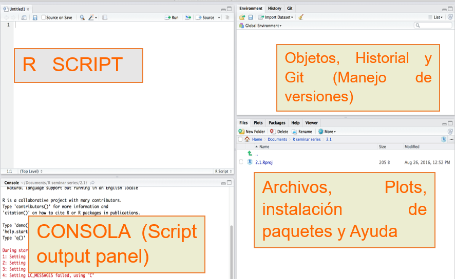

# CAPÍTULO 1: Introducción al análisis espacial utilizando R

## Instalación de R y RStudio

**R**, también conocido como “GNU S”, es un entorno y un lenguaje para el analisis estadístico y la generación de gráficos. R es un lenguage derivado del programa S, desarrollado en los Laboratorios Bell por John Chambers [@richard_a._becker_s_nodate].<!-- Insertado Todavia me falta afinar -->

R provee un acceso relativamente sencillo a una amplia variedad de técnicas estadísticas y graficas. Adicionalmente, R constituye un lenguaje de programación completo con el que añadir nuevas técnicas mediante la definición de funciones. “S ha modificado para siempre la forma en la que las personas analizan, visualizan y manipulan los datos” (Association of Computer Machinery Software System Award 1998 a John Chambers).

Actualmente, S y R son los dos lenguajes más utilizados en investigación en estadística. 

Los grandes atractivos de R/S son: 

- La capacidad de combinar, sin fisuras, análisis “preempaquetados” (ej., una regresión logística) con análisis ad-hoc, específicos para una situación: capacidad de manipular y modificar datos y funciones. 
- Los gráficos de alta calidad: visualización de datos y producción de gráficos para papers.
- La comunidad de R es muy dinámica, con gran crecimiento del número de paquetes, e integrada por estadísticos de gran renombre (ej., J. Chambers, L. Terney, B. Ripley, D. Bates, etc.). 
- Hay extensiones específicas a nuevas ´áreas como bioinformática, geoestadística y modelos gráficos.
- Es un lenguaje orientado a objetos.

### Obtención e instalación de R / Rstudio

Depende del sistema operativo, pero todo se puede encontrar en:

  - [http://cran.es.r-project.org/bin](http://cran.es.r-project.org/bin)

**Windows:** se puede obtener un ejecutable desde  [http://cran.es.r-project.org/bin/windows/base](http://cran.es.r-project.org/bin/windows/base) por ejemplo la versión de 32 bits [R-2.4.1-win32.exe](http://cran.es.r-project.org/bin/windows/base/R-2.4.1-win32.exe)

Al ejecutar el archivo se instalará el sistema base y los paquetes recomendados. 

**GNU/Linux:** (dos opciones) 

a. Obtener el R-x.y.z.tar.gz y compilar desde las fuentes. También bajar los paquetes adicionales e instalarlos. (Buena forma de comprobar que el sistema tiene development tools). 

b. Obtener binarios (ej., \*.deb para Debian, \*.rpm para RedHat, SuSE, Mandrake)

### RSTUDIO

Es una poderosa herramienta de desarrollo integrado un ambiente de desarrollo integrado, donde se puede desarrollar los diferentes proyectos que se aborden utilizando el leguaje R.

Se puede descargar la última versión del programa desde:

[https://www.rstudio.com/](https://www.rstudio.com/)

#### Ambiente de Desarrollo



## Introducción a la programación

### Hola Mundo

**R** Utilizamos la función *print()* para desplegar información en la pantalla

```{r}
##Hola Mundo
print("Hola Mundo")
print(paste('Hola,', 'como', 'estas?'))
```

### Calculadora

**R** puede ser utilizado como calculadoradesde la consola, tiene diversas funciones como ser *sqrt* (raiz cuadrada), *pi* (número pi), *sin* (la función seno), y muchos otros. Aca se puede encontrar una lista de algunos de ellos [https://www.rdocumentation.org/packages/pbdDMAT/versions/0.5-1/topics/math](https://www.rdocumentation.org/packages/pbdDMAT/versions/0.5-1/topics/math).

```{r}
#Operaciones básicas
2+2/2
#utilizando la funcion raiz cuadrada
sqrt(9)/3
#el numero pi
pi
#utilizando la función seno
sin(23)
```

#### Trabajar con vectores

Uno de los elementon básicos con los que se trabaj en R son los vectores. Un **vector** es una secuencia de datos de algún elemento básico.

```{r}
# Números
c(1,2,3,4,5)
#lógicos
c(T,F,T,T,T)
#cadenas
```


